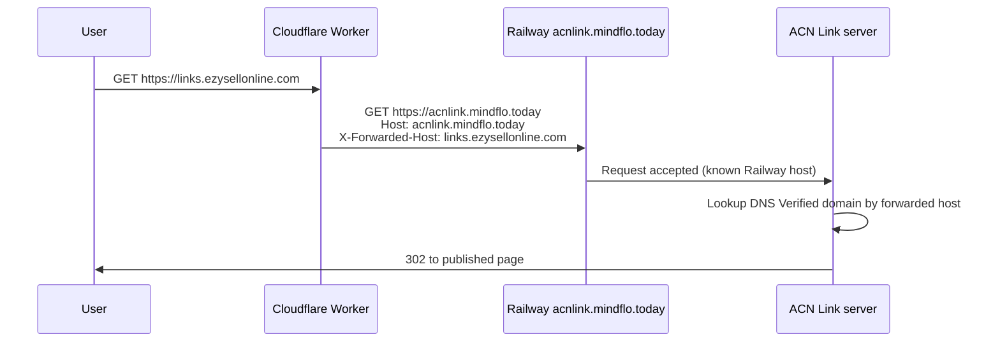

# Free custom domain test with a Cloudflare Worker

Use this when:

- Railway allows only **one** custom domain (your platform URL, e.g. `acnlink.mindflo.today`).
- Cloudflare for SaaS is **not** configured (no paid SaaS / API token).
- A customer domain shows **DNS Verified** in ACN Link but `https://links.customer.com` returns Railway **Not Found**.

The Worker sits on the **customer's** Cloudflare zone. It accepts `links.customer.com`, forwards the request to your Railway app as `acnlink.mindflo.today`, and sets `X-Forwarded-Host` so ACN Link routes to the correct published page.

## Example test domain

| Item | Value |
|------|--------|
| Platform (Railway) | `acnlink.mindflo.today` |
| Customer domain | `links.ezysellonline.com` |
| DNS CNAME | `links` → `acnlink.mindflo.today` (Proxied) |
| ACN Link status | DNS Verified |

## Before you start

1. Domain is connected in ACN Link and **DNS Verified** (click **Check DNS and SSL now**).
2. Customer DNS zone is on Cloudflare (here: `ezysellonline.com`).
3. Railway env includes `CUSTOM_DOMAIN_CNAME_TARGET=acnlink.mindflo.today`.

## Step 1 — Create the Worker

1. Log in to [Cloudflare Dashboard](https://dash.cloudflare.com).
2. Open **Workers & Pages** → **Create** → **Create Worker**.
3. Name it e.g. `acnlink-custom-domain-proxy`.
4. Replace the default script with:

```javascript
const PLATFORM_HOST = "acnlink.mindflo.today";

export default {
  async fetch(request) {
    const incoming = new URL(request.url);
    const customerHost = incoming.hostname;

    // Send visitors to the linked bio page on the branded URL.
    if (incoming.pathname === "/" && !incoming.searchParams.has("previewPageId")) {
      const resolve = await fetch(
        `https://${PLATFORM_HOST}/api/public/custom-domain/${encodeURIComponent(customerHost)}`
      );
      if (resolve.ok) {
        const data = await resolve.json();
        if (data?.pageId) {
          incoming.searchParams.set("previewPageId", data.pageId);
          return Response.redirect(incoming.toString(), 302);
        }
      }
    }

    const upstreamUrl = new URL(request.url);
    upstreamUrl.hostname = PLATFORM_HOST;
    upstreamUrl.protocol = "https:";

    const headers = new Headers(request.headers);
    headers.set("Host", PLATFORM_HOST);
    headers.set("X-Forwarded-Host", customerHost);
    headers.set("ACN-Customer-Host", customerHost);
    headers.set("X-Forwarded-Proto", incoming.protocol.replace(":", ""));

    const init = {
      method: request.method,
      headers,
      redirect: "manual"
    };
    if (request.method !== "GET" && request.method !== "HEAD") {
      init.body = request.body;
    }

    return fetch(upstreamUrl.toString(), init);
  }
};
```

5. Click **Deploy**.

> Change `PLATFORM_HOST` if your Railway URL is different.

## Step 2 — Attach the Worker to the customer hostname

1. In the Worker, go to **Settings** → **Domains & Routes** (or **Triggers** → **Routes**).
2. Add a route:

   ```text
   links.ezysellonline.com/*
   ```

   Use your real subdomain instead of `links.ezysellonline.com`.

3. Save. Cloudflare runs this Worker **before** the CNAME target is contacted.

Keep the existing DNS record:

```text
Type: CNAME
Name: links
Target: acnlink.mindflo.today
Proxy: Proxied (orange cloud)
```

## Step 3 — Redeploy ACN Link (code change)

Deploy the backend that treats **DNS Verified** as routable (not only **Verified**). After deploy, the server accepts `X-Forwarded-Host: links.ezysellonline.com` and redirects to the linked bio page.

## Step 4 — Test

1. Open `https://links.ezysellonline.com` in a private/incognito window.
2. You should see the published page linked to that domain in ACN Link (not Railway Not Found).
3. In ACN Link → Custom Domains, status should stay **DNS Verified** (green). That is expected without Cloudflare for SaaS.

Quick checks:

```bash
curl -I https://links.ezysellonline.com
```

Expect `302` to `/?previewPageId=...` or the rendered page.

## How it works



## Troubleshooting

| Symptom | Fix |
|---------|-----|
| Railway **Not Found** | Worker route missing or wrong hostname pattern. Add `links.yourdomain.com/*`. |
| **Domain not connected** (ACN Link HTML) | DNS not verified in app, or wrong `X-Forwarded-Host`. Re-verify DNS; redeploy latest server. |
| **Session expired** in dashboard | Log out, clear site data, log in again. Set `VITE_AUTH_PREVIEW=false` on Railway. |
| SSL error on customer domain | Keep DNS **Proxied** on Cloudflare; Worker + orange cloud provides HTTPS. |
| Wrong page shown | In ACN Link, check which bio page is linked to that domain. |

## Production later

For many customers without per-domain Workers:

1. Upgrade Railway plan (more custom domains), **or**
2. Enable **Cloudflare for SaaS** on `mindflo.today` with `CLOUDFLARE_*` env vars — then status becomes **Verified** with automatic SSL.

The Worker path is ideal for **one free test** on a zone you control (`ezysellonline.com`).
